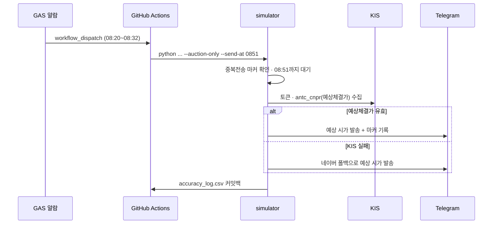

# etf-info — TIGER 미국우주테크 ETF 개장 예측기


> 미국 우주테크 종목과 환율을 추적해 **TIGER 미국우주테크 ETF(`0183J0`)의 그날 예상 시가를 개장 전 아침 08:51에 텔레그램으로 알려주는** 개인용 예측 스크립트.

<!-- 스크린샷: 텔레그램 발송 메시지 (추후) -->

동시호가에서 KIS 예상체결가를 수집해 예상 시가를 발송하고, 다음 실행에서 실제 시가와 대조해 정확도를 자기평가한다.

## 발송 흐름 (아침 08:51 예상 시가)



## Quick Start

```powershell
pip install -r requirements.txt
python tiger_etf_simulator.py     # 현재 시장 상태에 맞춰 자동 판정
```

설정은 예시 파일을 복사해 실제 키를 채운다:

- `kis_config.json` — KIS(한국투자증권) OpenAPI 키 (토큰은 `token_cache.json`에 20h 캐싱)
- `telegram_config.json` — 텔레그램 봇 토큰·chat id

> 비밀 파일(`kis_config.json`·`telegram_config.json`·`token_cache.json`)은 `.gitignore` 대상 — 커밋 금지.

## 주요 기능

| 기능 | 설명 |
|---|---|
| 장전 예상 시가 알림 | 평일 08:51(공표 개시 08:50 + 1분)에 KIS 예상체결가(`antc_cnpr`)를 수집해 그날 시가를 예측·발송(하루 1회) |
| 장중 iNAV 괴리 확인 | 정규장(09:00~15:30)엔 KIS iNAV로 실시간 NAV·괴리율 비교(`live` 모드) |
| 시간대 모드 자동 전환 | 장중(실시간 비교) ↔ 장후/새벽(익영업일 예측) 자동 정렬 |
| 정확도 자기평가 | 발송 예측치를 실제 시가와 대조해 오차율·방향 적중을 `accuracy_log.csv`에 누적 |
| 정확도 보정 로직 | 비중 동적 정규화 · SPCX 편입 시차 보정 · 일할 신탁보수(연 0.49%) 차감 · 전일종가 바인딩 |
| 폴백 · 백오프 | KIS 실패 시 네이버 금융 스크래핑 폴백 · 레이트리밋 백오프 · 거래소 폴백 |

## Why

GitHub Actions cron은 정시 발화를 보장하지 못한다(실측 08:30 지시가 11:03에 실행). 그래서 **GAS 알람이 정각에 워크플로를 깨우고**, 스크립트는 상태 서버 없이 파일 캐시만으로 실행 간 상태를 잇는다. ETF 개장 예상 시가를 아침에 손안으로 받아보고 싶었고, 상용 도구엔 없는 예측이라 직접 만들었다.

## 기술 스택

| 영역 | 선택 | 이유 |
|---|---|---|
| 언어 | Python 3.11+ | 표준 라이브러리로 HTTP·JSON·CSV·날짜 처리, 의존성은 `requests` 1개 |
| 프레임워크 | 없음 | 하루 몇 회 실행되는 단발 스크립트 → 웹/DI 프레임워크는 과설계 |
| 시세·환율 | KIS OpenAPI(주) + 네이버(폴백) | 보유 KIS 계정으로 iNAV·예상체결가·환율까지 한 곳에서, 실패 시 무인증 폴백 |
| 스케줄러 | GAS `workflow_dispatch` + GitHub cron 백업 | cron 정시성 부재를 GAS 정각 발화로 우회 |
| 저장 | 로컬 JSON/CSV | 상태가 작고 단일 실행자 → DB 불필요 |
| 알림 | Telegram Bot | 무료·즉시·봇 토큰만으로 push |

## 자동 실행

- **주 경로**: GAS 알람([apps_script/](apps_script/)) — 평일 08:20~08:32 GitHub 워크플로를 `workflow_dispatch`로 깨움
- **백업**: GitHub Actions cron 2회 (08:57·09:05 KST) — GAS 가 못 깨웠을 때만 의미가 있다

## 테스트 · 린트

```powershell
python -m unittest test_auction_gate.py   # 동시호가 발송 게이트 순수함수 (자동/회귀)
python test_accuracy.py                    # 정확도 수동 점검 (라이브 API 의존, 시연용)
ruff check . ; ruff format .
```

## 문서

- 구조·흐름: `docs/개발/아키텍처.md`
- 결정 이력(ADR): `docs/개발/의사결정/` — GAS 정시 발송 · 하루1회 게이트 · 개장할인율 추정
- 팀 운영: `CLAUDE.md` · 진행 이력: `docs/작업로그/작업로그.html`

> 위 문서들은 **작업 레포에만** 있다(공개 미러 큐레이션 제외 대상). 그래서 **링크를 걸지 않는다** —
> 걸면 공개 저장소에서 404 가 된다. 설계·결정의 요지는 위 「발송 흐름」·「자동 실행」 절에 요약돼 있다.
</content>
</invoke>
